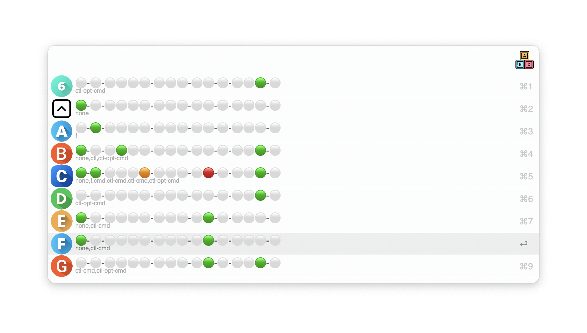

# Alfred's alphabet
## A dictionary of your [Alfred](https://www.alfredapp.com/) shortcuts

<!-- MarkdownTOC autolink="true" bracket="round" depth="3" autoanchor="true" -->

- [Motivation](#motivation)
- [Basic Usage](#usage)
- [Setting up](#setting-up)
- [Known Issues](#known-issues)
- [Acknowledgments](#acknowledgments)
- [Changelog](#changelog)
- [Feedback](#feedback)

<!-- /MarkdownTOC -->

<a href="https://github.com/giovannicoppola/alfred-alphabet/releases/latest/">
 
</a>

<h1 id="motivation">Motivation ✅</h1>

- To compile a dictionary of one-letter keywords used to launch Alfred workflows. 
- To check for overlap with a custom list of system-wide hotkeys 

You can launch Alfred Workflows using single letters (either alone, or with a prefix, or as hotkeys with modifiers), specifically:

1. single-letter keyword (e.g. `m` used for `m query`)
2. prefix + single letter keyword (e.g. `k` used with a prefix (`!`, -> `!k`) to search your Kindle library using `alfred-kindle`)
3. hotkey (a letter plus one or more of the modifier keys):
	1. 	Shift (⇧)
	2. Control (^)
	3. Option (⌥)
	4. Command (⌘)

	
`Alfred's Alphabet`	allows to review single-letter shortcuts in a single dictionary application, to check which letters are used, which are available, and which ones are conflicting with system-wide shortcuts. 

<h1 id="usage">Basic Usage 📖</h1>

## Browsing Alfred's Alphabet
- launch with keyword (default: `aalpha`), or custom hotkey
- scroll results or enter a single letter to filter. The first output is an overview with one circle per keyword/hotkey. 
- ⚪: unused prefix/hotkey modifier
-  🟠: prefix/hotkey modifier used for Alfred Workflow
-  🔴: used prefix/hotkey modifier, conflicting with one of the custom/system-wide shortcuts
- Circles are grouped in blocks as follows:
	1. no prefix (i.e. single-letter keyword)
	2. prefix block (if any): if any letter prefixes have been entered in `Workflow configuration`, they will be represented in this block (one circle per prefix)
	3. 1-key modifier keys in this order (block of 4): `shift`, `control`, `option`, `command`
	4. 2-key modifier keys: 
		- block of 3: `sht-ctl`, `sht-opt`, `sht-cmd`
		- block of 2: `ctl-opt`, `ctl-cmd`
		- block of 1: `opt-cmd`
	5. 3-key modifier keys (block of 3): `sht-ctl-opt`, `sht-ctl-cmd`, `ctl-opt-cmd`,
	6. 4-key modifier (block of 1): `sht-ctl-opt-cmd`
- `ctrl-enter` `^`↩️ will show the overview in large font
- `enter` ↩️ will list the workflows using that letter
- further pressing `enter` ↩️ will open the config page of the corresponding Workflow. 

## Saving custom hotkeys
- By entering `:aalpha` you can open a `csv` file with custom hotkeys. 
- Enter your own, using for the modifier key one of the abbreviations listed above. 
- A few examples are listed as demo in the default file. 

<h1 id="setting-up">Setting up ⚙️</h1>

- Alfred 5 with Powerpack license
- Python3 (howto [here](https://www.freecodecamp.org/news/python-version-on-mac-update/))
- Download `alfred-alphabet` [latest release](https://github.com/giovannicoppola/alfred-alphabet/releases/latest)

## Default settings 
- In Alfred, open the 'Configure Workflow' menu in `alfred-alphabet` preferences
	- *Optional*: set the keyword for the workflow (default: `aalpha`)
	- *Optional*: set a hotkey for the workflow
	- *Optional*: enter letter prefixes (one or more characters), separated by space, e.g. `! @ aa` for the prefixes `!`, `@`, and `aa`. 
	- *Optional*: check the `Include Disabled Workflows` checkbox if you want to include disabled Workflows

<h1 id="known-issues">Limitations & known issues ⚠️</h1>

- Alfred allows to restrict the scope of a hotkey (for example a hotkey may work only if a specific application has focus). `Alfred-alphabet` will not include this in the output, or in determining conflicts. 
- None for now, but I have not done extensive testing, let me know if you see anything!

<h1 id="acknowledgments">Acknowledgments 😀</h1>

- Thanks to the [Alfred forum](https://www.alfredforum.com) community!

<h1 id="changelog">Changelog 🧰</h1>

- 07-07-2023: version 0.1

<h1 id="feedback">Feedback 🧐</h1>

Feedback welcome! If you notice a bug, or have ideas for new features, please feel free to get in touch either here, or on the [Alfred](https://www.alfredforum.com) forum. 

# Thank you

- Icons from [Flaticon](https://www.flaticon.com/)
	- https://www.flaticon.com/free-icon/abc-block_1915985
	- https://www.flaticon.com/free-icon/exclamation-mark_3840662
	- https://www.flaticon.com/free-icon/hash_5584488
	- https://www.flaticon.com/free-icon/discount_726476
	- https://www.flaticon.com/free-icon/number-7_8068348
	- https://www.flaticon.com/free-icon/number-8_3840772
	- https://www.flaticon.com/free-icon/number-9_9494634
	- https://www.flaticon.com/free-icon/0_3600997
	- https://www.flaticon.com/free-icon/letter-g_9037231
	- https://www.flaticon.com/free-icon/at-sign_2098725
	- https://www.flaticon.com/free-icon/letter-f_3665934
	- https://www.flaticon.com/free-icon/up_9666586?
	- https://www.flaticon.com/free-icon/h_3600921
	- https://www.flaticon.com/free-icon/letter-v_3665989
	- https://www.flaticon.com/free-icon/x-button_458594?
	- https://www.flaticon.com/free-icon/letter-w_6646535